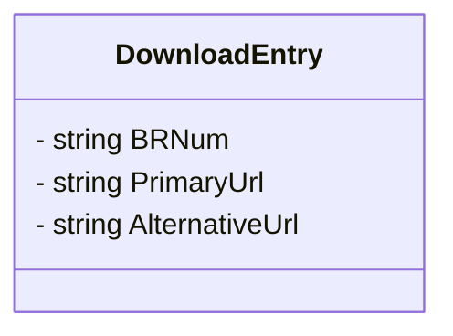
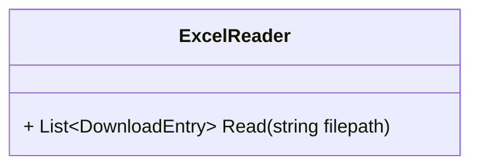
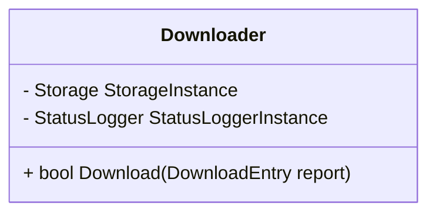
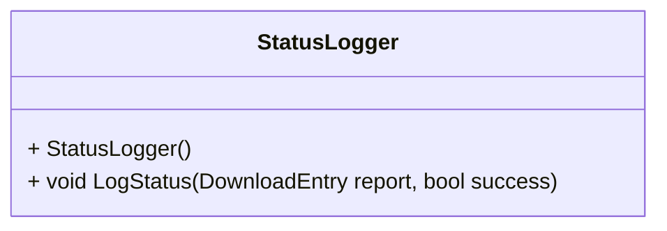
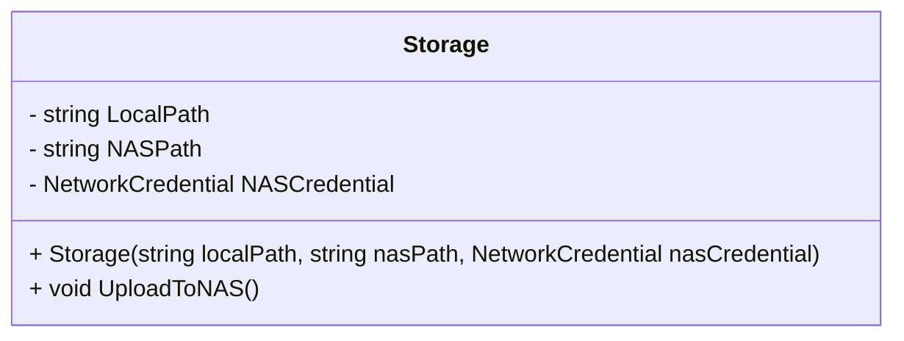
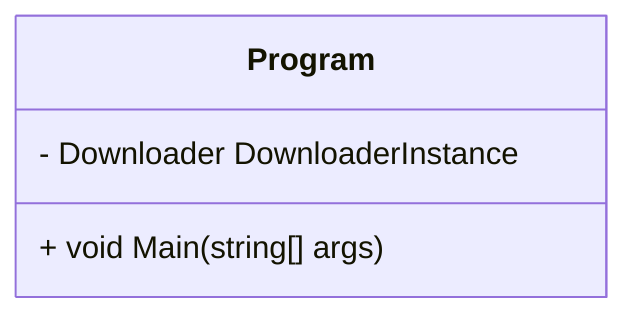
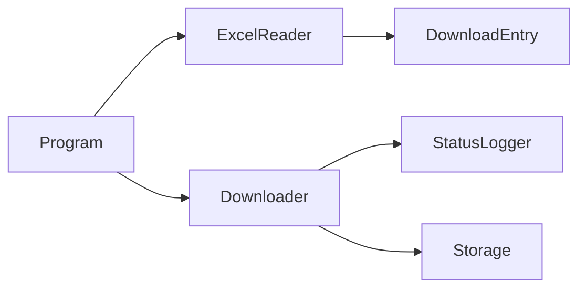

# Klassediagram

## Indholdsfortegnelse

- [Klassediagram](#klassediagram)
  - [Indholdsfortegnelse](#indholdsfortegnelse)
  - [DownloadEntry](#downloadentry)
  - [ExcelReader](#excelreader)
  - [Downloader](#downloader)
  - [StatusLogger](#statuslogger)
  - [Storage](#storage)
  - [Program](#program)
  - [Overview](#overview)

## DownloadEntry

## ExcelReader

## Downloader

## StatusLogger

## Storage

## Program

## Overview

